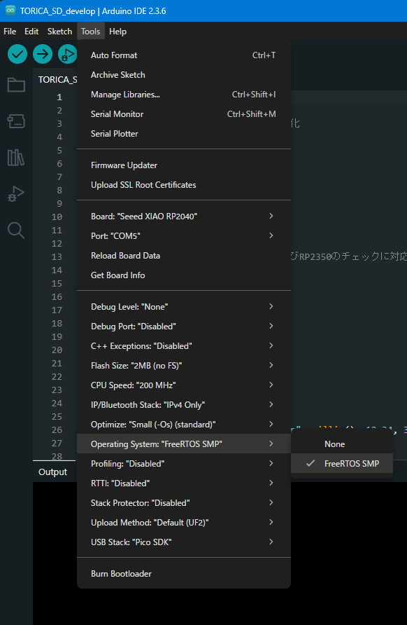

# TORICA_Software_Library
ソフトウェアのライブラリ
## RP2040/RP2350系マイコン使用上の注意
TORICA_WebServerでFreeRTOSを使用している影響で，FreeRTOSを有効化しないとコンパイルエラーとなります． 

## TORICA_WebServer
- TORICA_Software_Libraryに含めるかどうするか相談
- とりあえず含める方向で
[デモンストレーション](https://00kenno.github.io/publisher/demo/)
## ESP32への対応
- TORICA_SDを含む全てで問題なく動作すると思われる
- 特定困難なコンパイルエラーに遭遇した場合は班長に確認すること